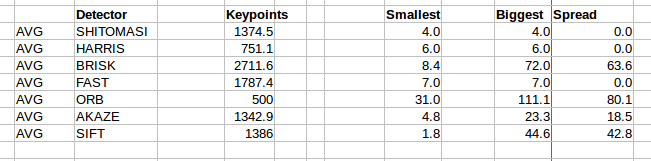

# Feature Tracking

The midterm project is in three parts, MP7, MP8 and MP9.

Project MP7:

Given a set of 10 images, count the number of keypoints found in each image using the following keypoint detector methods:
* SHITOMASI, HARRIS, BRISK, FAST, ORB, AKAZE, SIFT.

The results I obtained are contained in a spread sheet and log file in the spreadsheets directory in file MP7.ods.
The figure below is a screen shot of the summarized results. 'AVG' refers to averaged results over ten images:

Of note is that:

* Detectors SHITOMASI,HARRIS and FAST are fixed size detectors.
* Detectors BRISK and ORB have the most variable feaure sizes.
* Detectors BRIS, FAST and AKAZE find the most features.

Project MP8:

For the same set of 10 images of MP7, we are to count the number of matched keypoints for all combinations of the above feature detectors and these descriptors:

* BRIEF, ORB, FREAK, AKAZE, SIFT, BRISK

A brute force matcher is used and a KNN selector with a minimum descriptor distance ratio 0f 0.8.
The figure below is a screen shot of the summarized results. 'AVG' refers to averaged results over ten images:

Of note is that:
