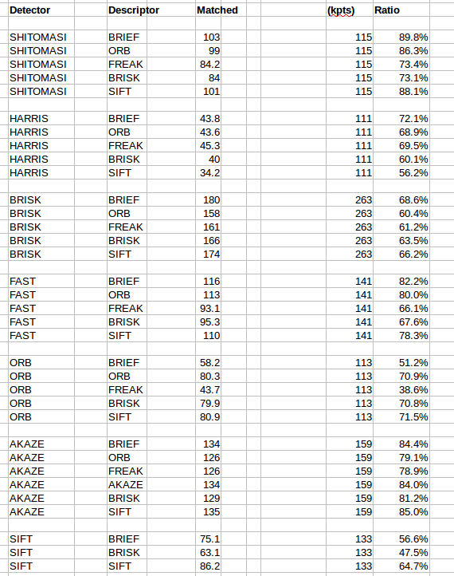

# Feature Tracking

The midterm project is in three parts, MP7, MP8 and MP9.

Project MP7:

Given a set of 10 images, count the number of keypoints found in each image using the following keypoint detector methods:
* SHITOMASI, HARRIS, BRISK, FAST, ORB, AKAZE, SIFT.

The results I obtained are contained in a spread sheet and log file in the spreadsheets directory in file MP7.ods.
The figure below is a screen shot of the summarized results. 'AVG' refers to averaged results over ten images:

Of note is that:

* Detectors SHITOMASI, HARRIS and FAST are fixed size detectors.
* Detectors BRISK and ORB have the most variable feaure sizes.
* Detectors BRISK, FAST and AKAZE find the most features.

Project MP8:

For the same set of 10 images of MP7, we are to count the number of matched keypoints for all combinations of the above feature detectors and these descriptors:

* BRIEF, ORB, FREAK, AKAZE, SIFT, BRISK

A brute force matcher is used and a KNN selector with a minimum descriptor distance ratio 0f 0.8.
The figure below is a screen shot of the summarized results. Results are averaged over nine match operations:

As before detailed results are in found in the spreadsheets directory. The above image are averaged results. Column 'Matched' refers to the count of matched keypoints or features. Column '(kpts)' refers to keypoints in the second image and is included for reference. Finally, columnd 'Ratio' is the ratio of matched keypoints to keypoints in the second image.

Of note is that:

* The greatest number of matched keypoints occurs with the detector BRISK;
* The HARRIS detector creates the lowest number of matches;
* The AKAZE detector creates a consistently high ratio of matches to keypoins.

Project MP9:

For project MP9 the time to detect and extract features is recorded. This is done for all combinations of detectors and descriptors as in MP.8. The figure below is a screen shot of the summarized results

Of note is:

* FREAK descriptor consistently take a long time to extract features--about 40ms;
* BRIEF as desciptor consistently extracts features quickly--order of 1 ms;
* On the basis of total time alone, FAST+BRIEF, FAST+ORB and FAST+BRISK stand out;
* On the second level of low total time are ORB+BRIEF, ORB+BRISK;
* On the third level of low total time are ORB+ORB, SHITOMAIS+BRIEF, SHITOMASI+ORB.

Conclusion:

To select the best three combinations of feature descriptor and feature descriptor based on the data, the criteria must be:

* Total time to detect and extrac;
* Number of keypoints detect in image;
* Quality of matched keypoints.

We have good measures of the first two criteria. Quality of matched features is unknwon from this analysis. We may postulate that a high ratio of matched features to features detected may indicate good quality of matched features.

On that basis, a top choice is FAST+BRIEF. This combination is fastest in total time of detection and extraction. Also, FAST is a top producer of features per image. Finally, FAST+BRIEF has over 80% matches to detections. A second choice is FAST+ORB, which has a very similar score on the criteria as our first choice. As a third and final choice, we select SHITOMASI+BRIEF as it is realtively fast in detection and extraction, generates large number of features per image and has a very high ratio of matches to features detected.

